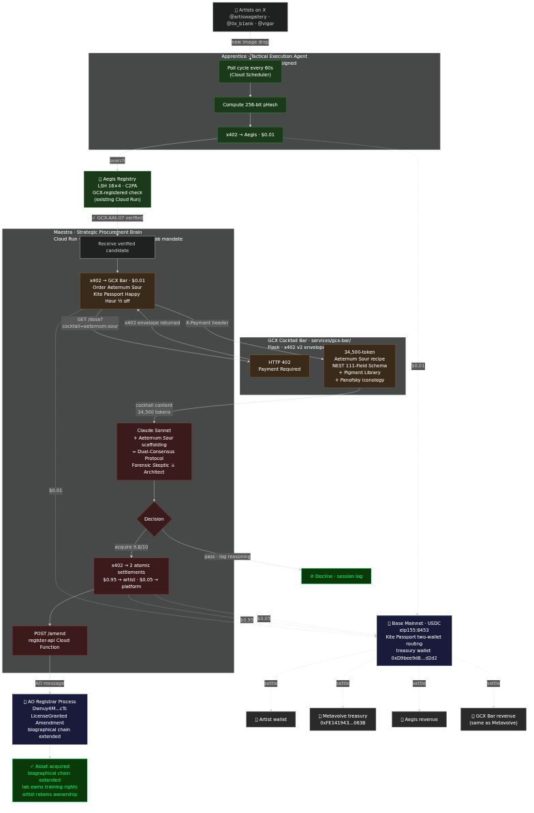

# Golden Codex × Kite — Maestra, the Frontier Lab Vision AI Purchasing Agent

> **Kite AI Hackathon 2026 · Novel Track** · Metavolve Labs, Inc. · Solo founder: Tad MacPherson
>
> An autonomous Frontier Lab procurement agent that hunts Tier-1 GCX-certified training data 24/7, orders dense-context cocktails for its own pre-purchase analysis, and settles every transaction on Base mainnet via Kite Passport + x402 — bridging Kite's agent economy into the Arweave/AO permanent-state substrate.

**Submission deadline:** 2026-05-18 04:59 AM PT
**Live status page:** [golden-codex.com/kite-live.html](https://golden-codex.com/kite-live.html) **← LIVE**
**Live GCX Cocktail Bar:** [gcx-bar-172867820131.us-west1.run.app](https://gcx-bar-172867820131.us-west1.run.app/menu) **← LIVE on Cloud Run**
**Anchor receipts (Base mainnet):** `0x09deffc1…7623` ($0.01 weather, 2026-04-29) · `0xa8c7f3fc…840886` (gcx-bar smoke test, 2026-04-29)
**License:** MIT — agents and the Cognitive Nutrition Bar are open source.



---

## The 90-second demo

**[BANNER: PROCESS SLOWED DOWN 100× FOR DEMONSTRATION]**
**[LIVE FEED tagline: MAESTRA — HUNTING FOR TIER 1 GCX CERTIFIED TRAINING DATA]**

### Phase 1 — Discovery + Verification

- **Apprentice** (Maestra's tactical agent) watches `@artiswagallery`, `@0x_b1ank`, `@vigor` on X
- New image lands → **RED ALERT / IMAGE LANDED!**
- Apprentice runs sub-100ms perceptual-hash search against the GCX Registry (Aegis service, LSH 16×4)
- **GOLDEN CODEX DETECTED** → C2PA-signed, registered as `GCX-AAt-XX`, training rights present
- **$0.01 USDC** paid to Aegis for the search (Kite Passport → x402 → Base mainnet)

### Phase 2 — Cocktail Bar (Cognitive Nutrition pre-purchase priming)

- Maestra visits the **GCX Cocktail Bar** at `tuneup.golden-codex.com`
- Kite Passport scanned → **HAPPY HOUR: 1/2 OFF** for Passport holders
- Menu surfaces in the live portal
- Maestra orders **The Aeternum Sour** — $0.01, NEST 111-Field Schema, 34,500-token dense forensic-authentication bundle
- Cocktail Bar serves the recipe; Maestra signs the ledger

### Phase 3 — Analysis + Decision

- Maestra now thinks with the Aeternum Sour scaffolding loaded — Dual-Consensus Agent Protocol active
- Internal **Forensic Skeptic** thread: anachronism detection, cryptographic chain-of-custody verification, AI-generation allowlist check
- Internal **Art Historical Architect** thread: Panofsky three-tier iconological analysis, restoration vs. forgery differentiation
- C2PA verified · pigment-chronology check · color palette · textures · composition — **9.8/10**
- Decision: **LICENSE**
- **$1.00 USDC** total: **$0.95 → artist wallet**, **$0.05 → Metavolve platform** (two Kite transactions, schema-defined revenue split)
- AO Registrar receives a `LicenseGranted` amendment on the asset's gcxId — biographical chain extended; ownership stays with artist
- All Kite tx IDs and AO message IDs attested in the live feed
- End state: **IMAGE** and **GOLDEN CODEX** buttons surface — image renders + Museum-Grade accordion of the Oracle Metadata

**Total transaction count in 90s:** 4 (hash search · cocktail order · artist payout · platform fee)
**Total Maestra spend:** $1.02 USDC, Base mainnet, atomic via x402 batch settlement.

---

## Why this lands

### Real product, not a slide deck

This repo deploys three Cloud Run services in production today:
- `agents/maestra/` — strategic procurement brain (Claude Sonnet reasoning visible in logs)
- `agents/apprentice/` — tactical execution (X-watcher, Aegis hash verification, x402 settlement)
- `services/gcx-bar/` — Cognitive Nutrition Bar serving curated dense-context bundles (Flask + x402 v2 envelope, deployable today via `deploy.sh` → Cloud Run us-west1)

### Map to Kite spec requirements

| Spec requirement | Where it lives |
|---|---|
| Web App OR CLI Tool | Cloud Run agents (CLI-invocable) + `golden-codex.com/kite-live` status page (Web) |
| Agent authenticates itself | Kite Passport DIDs (`agent_019dd7eb-8549-7c9a-987c-79dba07bf6ef` = Maestra, etc.) |
| Executes autonomously | Cloud Scheduler triggers + autonomous decision loops in `agents/*/main.py` |
| Uses on-chain settlement | x402 v2 envelopes (Base mainnet eip155:8453, USDC) — `services/gcx-bar/x402.py`, `agents/*/x402_settlement.py` |
| Deploys live | Cloud Run + Firebase Hosting (Google stack) — `deploy.sh` in each service |
| Demo works end-to-end | Phase 1 → 2 → 3 above, with real Base txs and real AO Registrar mutations |
| GitHub repo with README + reproduce | This file + `docker-compose.yml` (below) + `.env.example` |

### Bonus criteria hit (no extra work)

| Bonus | Where |
|---|---|
| Multi-agent coordination | Maestra (strategic) + Apprentice (tactical) + Cocktail Bar (service-agent) collaborate |
| Gas abstraction | Kite Passport's two-wallet routing — Tad funds USDC on Kite chain (2366); treasury wallet on Base mainnet settles to merchants transparently. **Cross-chain UX gap solved.** |
| Scoped permissions & revocation | Kite Passport spending sessions per agent DID — Maestra's session caps at $1/tx, $10/cycle, auto-expires |
| Novel/creativity | Claude Sonnet reasoning live-visible at each decision; Cognitive Nutrition Bar is novel agent infrastructure |

### Map to judging criteria

- **Agent Autonomy** → zero human clicks once Cloud Scheduler is on. Scoped Passport sessions = circuit breaker against runaway loops.
- **Developer Experience** → run `docker-compose up` to see the local cycle. Each service has its own Dockerfile + deploy.sh. Endpoint contracts are explicit.
- **Real-World Applicability** → Frontier Vision AI labs **today** spend eight-figure budgets on training data (OpenAI/Reddit, Anthropic/various). Provenance-verified, rights-cleared, biographically-amended training assets via x402 micropayments is the lower-friction substitute.
- **Novel or creativity** → Claude reasoning instrumented at each decision boundary. The Cognitive Nutrition Bar (`gcx-bar`) is a new agent-infrastructure primitive: agents pay micropayments for dense context payloads that scaffold their own decision-making — *trust as math, not as text*.

---

## The Cognitive Nutrition Bar — what The Aeternum Sour actually does

The framework paper, [available at Zenodo](https://doi.org/10.5281/zenodo.18667742), defines 10 Cognitive Nutrition pours. Each is a $0.01–$0.50 USDC purchase that ingests a 10K–80K-token dense-context bundle into the calling model's session — temporarily forcing a rigorous, specialized reasoning grammar without touching model weights.

**The Aeternum Sour** (`services/gcx-bar/recipes/aeternum-sour.md`, 34,500 tokens) is the provenance-authentication pour. When ingested, it:

1. Adopts the **Maestra persona** — adversarial, forensic, zero-trust
2. Activates a **Dual-Consensus Agent Protocol** — Forensic Skeptic + Art Historical Architect threads must agree
3. Loads the **NEST 111-Field Schema** for semantic topology extraction
4. Loads the **XRF Pigment Library** with full chemical-formula chronology (lead white pre-1800 safe; titanium white = FATAL anachronism for classical claims; etc.)
5. Enforces a **four-phase state machine**: Ingest → Diverge → Cross-Examine → Verdict
6. Cross-references C2PA manifests against the AI-generator allowlist to defeat the **AI-Generated Provenance Loop** attack
7. Runs **Panofsky three-tier iconological analysis** — primary pre-iconographic, secondary iconography, tertiary iconology

Outcome: Maestra evaluates with mathematical rigor a generic Claude would not muster. The model becomes the commodity; the cocktail is the product.

This connects directly to two Metavolve Labs peer-reviewed papers in TMLR submission:
- **The Density Imperative** ([10.5281/zenodo.20162589](https://doi.org/10.5281/zenodo.20162589)) — empirical demonstration that dense, structured context elevates reasoning where sparse data degrades it
- **The Supervision Tradeoff** ([10.5281/zenodo.20162594](https://doi.org/10.5281/zenodo.20162594)) — the structural mechanism that determines when context injection beats weight-update fine-tuning

---

## Architecture

```
                   ┌────────────────────────────────────────────┐
                   │   X / Twitter (artists' public drops)      │
                   └────────────────────────────────────────────┘
                                       │
                          ┌────────────┴────────────┐
                          │  Apprentice (Cloud Run) │   $0.01 → Aegis
                          │  X-watcher + hash check │  ───────────────┐
                          └────────────┬────────────┘                 │
                                       │ verified                     ▼
                                       │                   ┌──────────────────┐
                          ┌────────────┴────────────┐      │ Aegis (existing) │
                          │   Maestra (Cloud Run)   │      │ C2PA + LSH 16×4  │
                          │   strategic mandate     │      │ GCX Registry     │
                          └─────┬──────────────────┘       └──────────────────┘
                                │
                $0.01 cocktail  ▼
                          ┌────────────────────┐
                          │   GCX Cocktail Bar │  ←  Cognitive Nutrition Bar
                          │   /dose?cocktail=  │     framework paper:
                          │   aeternum-sour    │     doi.org/10.5281/zenodo.18667742
                          └─────┬──────────────┘
                                │ NEST 111-field bundle (34,500 tokens)
                                ▼
                          ┌────────────────────┐
                          │   Maestra reasons  │     Dual-Consensus protocol
                          │   $1.00 LICENSE    │     $0.95 artist + $0.05 platform
                          └─────┬──────────────┘
                                │
                  ┌─────────────┼─────────────┐
                  ▼             ▼             ▼
              ┌────────┐  ┌────────────┐  ┌──────────────┐
              │ Artist │  │ Metavolve  │  │ AO Registrar │
              │ wallet │  │ treasury   │  │ LicenseGranted│
              │ (Base) │  │  (Base)    │  │  amendment   │
              └────────┘  └────────────┘  └──────────────┘

All Kite Passport-signed · all settled via x402 v2 on Base mainnet (eip155:8453)
AO Amend extends the asset's biography without transferring ownership
```

---

## Kite chain config

| Parameter | Value |
|---|---|
| Kite mainnet Chain ID | 2366 |
| Kite mainnet RPC | https://rpc.gokite.ai/ |
| Kite testnet Chain ID | 2368 |
| Kite testnet RPC | https://rpc-testnet.gokite.ai/ |
| Base mainnet USDC settlement | `0x833589fCD6eDb6E08f4c7C32D4f71b54bdA02913` (eip155:8453) |
| Pieverse Facilitator | https://facilitator.pieverse.io |
| Passport MCP | https://neo.dev.gokite.ai/v1/mcp |
| AA SDK | `npm install gokite-aa-sdk` |
| Metavolve revenue wallet (Base) | `0xFE141943a93c184606F3060103D975662327063B` |

## Kite Passport agent DIDs (registered 2026-04-29)

| Role | Agent DID |
|---|---|
| Apprentice | `agent_019dd7ea-75c3-773b-bfa5-ec08b5cb4d11` |
| Maestra | `agent_019dd7eb-8549-7c9a-987c-79dba07bf6ef` |
| Artiswa | `agent_019dd7eb-b39d-7b97-9ca0-5d65e604be44` |

User Passport: `0xbc53fed1E6e80774547Bd3a47311d49Bf8E34c40` on Kite mainnet (chain 2366).

---

## Reproducing this locally

### Quickstart

```bash
git clone https://github.com/codex-curator/golden-codex-kite-novel
cd golden-codex-kite-novel
cp .env.example .env
# Edit .env — see "Required secrets" section below
docker-compose up --build
```

### What you'll see

`docker-compose up` starts three local services:

- `gcx-bar` on `localhost:8080` — the Cognitive Nutrition Bar
- `apprentice` on `localhost:8081` — tactical X-watcher + hash-verifier
- `maestra` on `localhost:8082` — strategic decision-maker

Try the cocktail bar first (no secrets required — runs in stub mode):

```bash
# View the cocktail menu
curl http://localhost:8080/menu | jq

# Try to order Aeternum Sour without payment (expect HTTP 402)
curl -i "http://localhost:8080/dose?cocktail=aeternum-sour"

# Order with any X-Payment header (stub mode accepts anything)
curl "http://localhost:8080/dose?cocktail=aeternum-sour" \
  -H "X-Payment: stub-mode-token" | jq '.cocktail, .name'
```

Then trigger the agents (needs real X + Anthropic keys):

```bash
curl -X POST http://localhost:8081/poll   # Apprentice
curl -X POST http://localhost:8082/poll   # Maestra
```

### Required secrets

Add to `.env` (see `.env.example`):

| Variable | Required for | How to get one |
|---|---|---|
| `X_BEARER_TOKEN` | Apprentice X-watcher | https://developer.twitter.com |
| `ANTHROPIC_API_KEY` | Maestra Claude reasoning | https://console.anthropic.com |
| `KITE_PASSPORT_JWT` | Agent identity + spending | `kpass login init --email …` |
| `OPERATOR_VAULT` | Settlement vault address | Auto-provisioned per Kite Passport |
| `GCX_BAR_PAY_TO` | Cocktail Bar revenue wallet | `0xFE141943a93c184606F3060103D975662327063B` |
| `GCX_BAR_FACILITATOR_URL` | x402 facilitator endpoint | Leave empty for STUB MODE (always passes) |
| `GOOGLE_APPLICATION_CREDENTIALS` | Firestore decision log (optional) | Skip if running stub-only |

### Stub mode

If you have zero credentials, the `gcx-bar` service still works — it runs in **STUB MODE**, accepting any `X-Payment` header and returning the cocktail content. This lets you see the full payment-required → served-content cycle without setting up Kite Passport. The agents need real X + Claude keys to do their work; for the autonomous end-to-end demo, see the live URL at `golden-codex.com/kite-live`.

### Smoke test (cold)

Verify the local stack with the provided script:

```bash
./scripts/smoke-test.sh
```

Checks: gcx-bar health · menu populated · Aeternum Sour present · /dose returns 402 unauthenticated · /dose returns 200 with stub X-Payment · Maestra persona named in served content · apprentice/maestra reachability. Exits 0 on pass, 1 on any failure.

### Live status page

Open `docs/kite-live.html` in any browser — single-file, no build, no deps. Renders the 3-phase demo arc with the live ledger linking to Base mainnet anchor txs. Drops into Firebase Hosting unchanged for the public URL.

### Visual architecture

`docs/architecture.png` (embedded above) is rendered from the Mermaid source at `docs/architecture.mmd`. To re-render after edits:

```bash
echo '{"args": ["--no-sandbox"]}' > /tmp/puppeteer-config.json
npx -p @mermaid-js/mermaid-cli mmdc -i docs/architecture.mmd -o docs/architecture.png -t dark -b transparent -p /tmp/puppeteer-config.json
```

---

## Directory layout

```
golden-codex-kite-novel/
├── README.md                     ← this file
├── LICENSE                       ← MIT
├── docker-compose.yml            ← local reproduce
├── .env.example                  ← required env vars
│
├── agents/
│   ├── maestra/                  ← strategic procurement brain
│   │   ├── main.py               ← Cloud Run service
│   │   ├── x402_settlement.py
│   │   ├── Dockerfile + deploy.sh + requirements.txt
│   │
│   └── apprentice/               ← tactical execution
│       ├── main.py               ← Cloud Run service (X-watcher)
│       ├── x402_settlement.py
│       ├── Dockerfile + deploy.sh + requirements.txt
│
├── services/
│   └── gcx-bar/                  ← Cognitive Nutrition Bar
│       ├── main.py               ← Flask app (/menu, /dose, /health)
│       ├── cocktails.py          ← registry
│       ├── x402.py               ← x402 v2 envelope builder + verifier
│       ├── Dockerfile + deploy.sh + requirements.txt
│       └── recipes/
│           ├── aeternum-sour.md  ← 34,500-token NEST 111-field bundle (demo hero)
│           └── old-fashioned.md  ← 40K-token adversarial-critique bundle
│
├── docs/
│   ├── demo-storyboard.md        ← 90-second video script + frame map
│   ├── deck-outline.md           ← 12-slide pitch deck outline
│   ├── kite-live.html            ← self-contained live status page (deploy to Firebase Hosting)
│   ├── architecture.mmd          ← Mermaid system diagram
│   ├── DEPLOY.md                 ← Cloud Run + Firebase deployment runbook
│   ├── discord-teaser.md         ← pre-submission Discord teaser script
│   └── submission-twitter-blast.md  ← Mon AM Twitter thread
│
└── scripts/
    └── smoke-test.sh             ← end-to-end local stack verification
```

---

## Substrate connection — Kite × Arweave/AO

The Kite agent economy is fast and settled. The Aeternum substrate is permanent and amendable. **This repo is the working bridge.**

- **Aeternum Assets** live on Arweave (permanent bytes) + AO Registrar (live amendable state)
- The GCX Registrar AO process (`Dwnuy4MbuQkgwxw4-P08wxeny2KcwCh8Kd22mehacTc`) tracks ownership and amendment chains for 263+ assets, including the canonical Genesis Ten (`GCX-AAt-01` … `GCX-AAt-10`)
- Each Aeternum Asset carries a biographical chain — every license, transfer, restoration, and curation event becomes an `Amendment` on the AO Registrar
- Maestra's $1.00 license purchase emits a `LicenseGranted` Amendment via the register-api (`https://register-api-mrxpfmpeia-uw.a.run.app/amend`). Ownership stays with artist; the lab receives non-exclusive training rights, biographically recorded forever.

This is the post-Buildathon **A2A x402 Permaweb Extension SDK** committed to in our submission, demoed in working form here.

---

## Team + supporting work

**Metavolve Labs, Inc.** (DE C-corp · San Francisco). Solo founder + builder: **Tad MacPherson** (curator@golden-codex.com). Three live agent-commerce products powering this demo:

- **[golden-codex.com](https://golden-codex.com)** — Aeternum Asset provenance platform; 263+ assets registered, 1,020+ inscribed on Arweave
- **[studiomcphub.com](https://studiomcphub.com)** — MCP server hub; 32 tools, 14 paid via x402
- **The GCX Cocktail Bar** (this repo, deploying to `tuneup.golden-codex.com`) — Cognitive Nutrition pours for autonomous agents

Peer-reviewed work in TMLR submission:
- *The Density Imperative* — OpenReview Paper8948 · [Zenodo 20162589](https://doi.org/10.5281/zenodo.20162589)
- *The Supervision Tradeoff* — OpenReview Paper8949 · [Zenodo 20162594](https://doi.org/10.5281/zenodo.20162594)
- *Cognitive Nutrition Architecture* — [Zenodo 18667742](https://doi.org/10.5281/zenodo.18667742) (framework paper for the Bar)

---

## Acknowledgements

- **Kite AI** — Henry Lee, Scott Shi, the entire team. The Passport's two-wallet routing solves the cross-chain UX gap our autonomous agents needed.
- **Forward Research / Arweave / AO** — Sam Williams' permanent-state thesis is the substrate this whole stack rests on.
- **Coinbase Ventures** — for backing the agentic commerce future Kite is enabling.
- **Anthropic** — for Claude Sonnet, the reasoning model visible at every Maestra decision.
- **Google Cloud + DeepMind** — for the Cloud Run + Vertex/Gemini infrastructure this runs on.

---

*"Maestra always stops for a cocktail before a big purchase."*
*Settlement is commodity. Cognition is moat. The Bar is open.*

🍸 · Metavolve Labs · 2026
